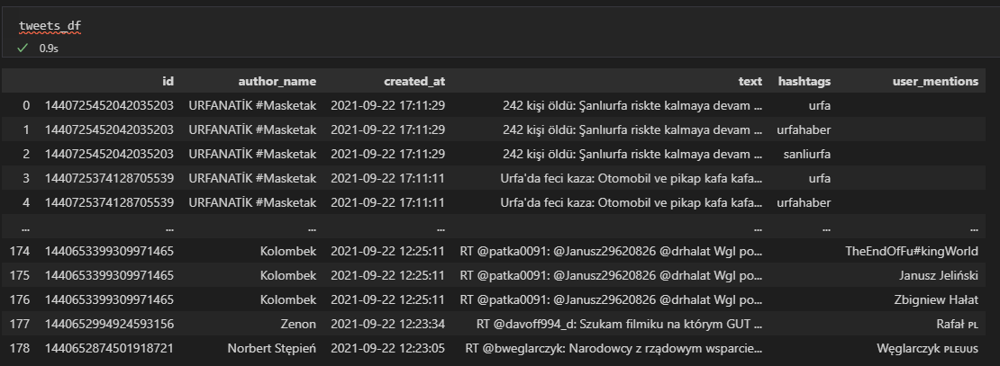
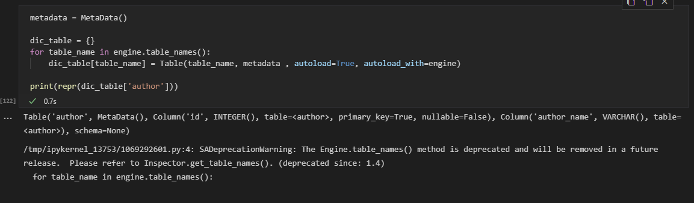

# Twitter analyzer
Simple scripts for scrapping data from twitter, creating postgresql database and filtering created data.

## Scrapping
```python
text_query = 'koronawirus'
count = 100     
try:
    # Creation of query method using parameters
    tweets = tweepy.Cursor(api.search,q=text_query).items(count)

    column_names = ['id', 'author_name', 'created_at', 'text', 'hashtags', 'user_mentions']
    tweets_list = [[tweet.id, tweet.user.name, tweet.created_at, tweet.text, 
                    [x['text'] for x in tweet.entities['hashtags']], 
                    [x['name'] for x in tweet.entities['user_mentions']]] for tweet in tweets]
    # Creation of dataframe from tweets list
    # Add or remove columns as you remove tweet information
    tweets_df = pd.DataFrame(tweets_list, columns=column_names).set_index('id').explode('hashtags').explode('user_mentions')
    tweets_df.to_csv('data_koronawirus.csv')
```
By defining the key word (text_query) script search for related twitts (100 - count) data. Then script saves the data in easy-to-read format.

```
	id	author_name	created_at	text	hashtags	user_mentions
0	"1440608813686538243	✧₊˚.	2021-09-22 09:28:01	RT @MZ_GOV_PL: Mamy 882 nowe i potwierdzone pr...	koronawirus	Ministerstwo Zdrowia
1	"1440608420780855300	MariaRazborska@2mara571	2021-09-22 09:26:27	@pikus_pol Tam👇jest wszystko opisane, ważne do...		PikuśPOL 🇵🇱 ‏📿
2	"1440608133022248995	Bilgorajska.pl	2021-09-22 09:25:18	882 nowe przypadki w kraju, 152 na Lubelszczyź...	Lubelszczyzna	
3	"1440608133022248995	Bilgorajska.pl	2021-09-22 09:25:18	882 nowe przypadki w kraju, 152 na Lubelszczyź...	"sarscov2	
4	"1440608133022248995	Bilgorajska.pl	2021-09-22 09:25:18	882 nowe przypadki w kraju, 152 na Lubelszczyź...	"covid19	
```
Different set:

##Creating Tables and relations between them

```python

# Association table MUser - Twitt
association_muser_twitt = Table('association_muser_twitt', base.metadata,
    Column('muser_id', Integer, ForeignKey('muser.id')),
    Column('twitt_id', Integer, ForeignKey('twitt.id')),
    PrimaryKeyConstraint('muser_id', 'twitt_id')
)

# Association table Hashtag - Twitt
association_hashtag_twitt = Table('association_hashtag_twitt', base.metadata,
    Column('hashtag_id', Integer, ForeignKey('hashtag.id')),
    Column('twitt_id', Integer, ForeignKey('twitt.id')),
    PrimaryKeyConstraint('hashtag_id', 'twitt_id')
)


# Tables definitions
class Author(base):
    __tablename__ = 'author'
    id = Column(Integer, Sequence('author_id'), primary_key=True)
    # id_str = Column('id_str', String, unique=True)
    author_name = Column('author_name', String)
    twitt = relationship("Twitt", back_populates="author")
    
    def __init__(self, author_name):
        # self.id_str = id_str
        self.author_name = author_name

class Twitt(base):
    __tablename__ = 'twitt'
    id = Column(Integer, Sequence('twitt_id'), primary_key=True)
    author_id = Column(Integer, ForeignKey('author.id'))
    author = relationship('Author', back_populates="twitt")
    
    muser = relationship("Muser", secondary=association_muser_twitt)
    hashtag = relationship("Hashtag", secondary=association_hashtag_twitt)
    
    text = Column('text', String)
    twitt_real_id = Column('twitt_real_id', String, unique=True)
    
    def __init__(self, twitt_real_id, text):
        self.twitt_real_id = twitt_real_id
        self.text = text
    
class Muser(base):
    __tablename__ = 'muser'
    id = Column(Integer, Sequence('muser_id'), primary_key=True)
    mentioned_user_name = Column('mentioned_user_name', String)
    
    def __init__(self, mentioned_user_name):
        self.mentioned_user_name = mentioned_user_name

class Hashtag(base):
    __tablename__ = 'hashtag'
    id = Column(Integer, Sequence('hashtag_id'), primary_key=True)
    hashtag_name = Column('hashtag_name', String)

    def __init__(self, hashtag_name):
        self.hashtag_name = hashtag_name
```
###Database consists of 4 main tables:
* Twitt - real index of the twitt, text (content of the twitt), author_id (who sent this)
* MUser - Mentioned users in the twitt, mentioned_user_name
* Hashtag - Hashtag used in the twitt, hashtag_name
* Author - author of the twitt, author_name

###And 2 auxiliary tables
* association_muser_twitt - consists of muser_id and twitt_id
* association_hashtag_twitt - consist of hashtag_id and twitt_id

###The relations between tables are following:
* Twitt - MUser - Many to Many relation (association_muser_twitt)
* Twitt - Hashtag - Many to Many relation (association_hashtag_twitt)
* Twitt - Author - Many to One relation (Author - parent)

## Parsing Data to tables

```python 
#%% read data
import pandas as pd
tweets_df = pd.read_csv('data_koronawirus.csv')
tweets_df['id'] = tweets_df['id'].astype(str)
tweets_df = tweets_df.fillna('')
#%% AUTHOR TABLE
authors_list = pd.DataFrame(tweets_df['author_name'].unique(), columns=['author'])
authors_list = authors_list.rename(columns = {'author':'author_name'})
authors_list.index.name = 'id'
#%% TWITT TABLE
twitt_list = tweets_df[['id', 'text', 'author_name']].drop_duplicates()
twitt_list = twitt_list.rename(columns = {'author_name':'author_id', 'id': 'twitt_real_id'}).reset_index().drop(columns = ['index'])
twitt_list['author_id'] = twitt_list['author_id'].map(lambda x:  authors_list[authors_list['author_name'] == x].index.values.astype(int)[0])
twitt_list.index.name = 'id'
#%% MUSER TABLE
muser_list = pd.DataFrame(tweets_df['user_mentions'].unique(), columns=['user_mentions'])
muser_list = muser_list.rename(columns = {'user_mentions':'mentioned_user_name'})
muser_list.index.name = 'id'

#%% HASHTAG TABLE
hashtag_list = pd.DataFrame(tweets_df['hashtags'].unique(), columns=['hashtags'])
hashtag_list = hashtag_list.rename(columns = {'hashtags':'hashtag_name'})
hashtag_list.index.name = 'id'
#%% TWITT-MSUER
twitt_muser_list = tweets_df[['id', 'user_mentions']].drop_duplicates()
twitt_muser_list = twitt_muser_list.rename(columns = {'id':'twitt_id', 'user_mentions':'muser_id'}).reset_index().drop(columns=['index'])
twitt_muser_list['twitt_id'] = twitt_muser_list['twitt_id'].map(lambda x:  twitt_list[twitt_list['twitt_real_id'] == x].index.values.astype(int)[0])
twitt_muser_list['muser_id'] = twitt_muser_list['muser_id'].map(lambda x:  muser_list[muser_list['mentioned_user_name'] == x].index.values.astype(int)[0])
# twitt_muser_list.index.name = 'id'
#%% TWITT-HASHTAG
twitt_hashtag_list = tweets_df[['id', 'hashtags']].drop_duplicates()
twitt_hashtag_list = twitt_hashtag_list.rename(columns = {'id':'twitt_id', 'hashtags':'hashtag_id'}).reset_index().drop(columns=['index'])
twitt_hashtag_list['twitt_id'] = twitt_hashtag_list['twitt_id'].map(lambda x:  twitt_list[twitt_list['twitt_real_id'] == x].index.values.astype(int)[0])
twitt_hashtag_list['hashtag_id'] = twitt_hashtag_list['hashtag_id'].map(lambda x:  hashtag_list[hashtag_list['hashtag_name'] == x].index.values.astype(int)[0])
# twitt_hashtag_list.index.name = 'id'
#%%
muser_list.to_sql('muser',engine, if_exists='append')
hashtag_list.to_sql('hashtag',engine, if_exists='append')
authors_list.to_sql('author',engine, if_exists='append')
# %%
twitt_list.to_sql('twitt',engine, if_exists='append')
#%%
twitt_muser_list.set_index(['muser_id']).to_sql('association_muser_twitt',engine, if_exists='append')
twitt_hashtag_list.set_index(['hashtag_id']).to_sql('association_hashtag_twitt',engine, if_exists='append')
```

## Example Queries

TODO
### filter by TVN24 bis
```python 
mapper_stmt = select([dic_table['twitt'].columns.twitt_real_id.label('id'),dic_table['author'].columns.author_name.label('author_name')]).where(dic_table['author'].columns.author_name == 'TVN24 BiS')
mapper_results = engine.execute(mapper_stmt).fetchall()
print(mapper_results)
```
result:
``` 
[('1440608813686538243', 'TVN24 BiS'), ('1440608420780855300', 'TVN24 BiS'), ('1440608133022248995', 'TVN24 BiS'), ('1440608014696738825', 'TVN24 BiS'), ('1440607960661512196', 'TVN24 BiS'), ('1440607867447377921', 'TVN24 BiS'), ('1440607639142948865', 'TVN24 BiS'), ('1440607517218787337', 'TVN24 BiS'), ('1440607091073318920', 'TVN24 BiS'), ('1440606975696326666', 'TVN24 BiS'), ('1440606719541866502', 'TVN24 BiS'), ('1440606517040873477', 'TVN24 BiS'), ('1440606343761592323', 'TVN24 BiS'), ('1440605804327886853', 'TVN24 BiS'), ('1440605414597427204', 'TVN24 BiS'), ('1440605342602170376', 'TVN24 BiS'), ('1440604984031154183', 'TVN24 BiS'), ('1440604895946567680', 'TVN24 BiS'), ('1440604875692281865', 'TVN24 BiS'), ('1440604554526015491', 'TVN24 BiS'), ('1440604462112907272', 'TVN24 BiS'), ('1440604357146275846', 'TVN24 BiS'), ('1440603839808229383', 'TVN24 BiS'), ('1440603699571687427', 'TVN24 BiS'), ('1440603685726220291', 'TVN24 BiS'), ('1440603671826350086', 'TVN24 BiS'), ('1440603621947633667', 'TVN24 BiS'), ('1440603522177777671', 'TVN24 BiS'), ('1440603357136052228', 'TVN24 BiS'), ('1440603283660312583', 'TVN24 BiS'), ('1440603121462353929', 'TVN24 BiS'), ('1440602957288931332', 'TVN24 BiS'), ('1440602462948257796', 'TVN24 BiS'), ('1440601969177989130', 'TVN24 BiS'), ('1440601849300619268', 'TVN24 BiS'), ('1440601729762873351', 'TVN24 BiS'), ('1440601610128744454', 'TVN24 BiS'), ('1440601566231203846', 'TVN24 BiS'), ('1440601494588329986', 'TVN24 BiS'), ('1440601357807861763', 'TVN24 BiS'), ('1440601285883949062', 'TVN24 BiS'), ('1440600942248824834', 'TVN24 BiS'), ('1440600836200013836', 'TVN24 BiS'), ('1440600815069134852', 'TVN24 BiS'), ('1440600658697076745', 'TVN24 BiS'), ('1440600521908232194', 'TVN24 BiS'), ('1440600498348826635', 'TVN24 BiS'), ('1440600188138115072', 'TVN24 BiS'), ('1440599977726648328', 'TVN24 BiS'), ('1440599944235139086', 'TVN24 BiS'), ('1440599754048634887', 'TVN24 BiS'), ('1440599674600112131', 'TVN24 BiS'), ('1440599634192203780', 'TVN24 BiS'), ('1440599548171223043', 'TVN24 BiS'), ('1440599378549346304', 'TVN24 BiS'), ('1440599329127878666', 'TVN24 BiS'), ('1440599297498574849', 'TVN24 BiS'), ('1440599257287847941', 'TVN24 BiS'), ('1440599255983345665', 'TVN24 BiS'), ('1440599209938280455', 'TVN24 BiS'), ('1440599005302378499', 'TVN24 BiS'), ('1440598959337062400', 'TVN24 BiS'), ('1440598881188802577', 'TVN24 BiS'), ('1440598856664633347', 'TVN24 BiS'), ('1440598748380348417', 'TVN24 BiS'), ('1440598694789713924', 'TVN24 BiS'), ('1440598599847399428', 'TVN24 BiS'), ('1440598550870593539', 'TVN24 BiS'), ('1440598423850274816', 'TVN24 BiS'), ('1440598241704173582', 'TVN24 BiS'), ('1440598201459900422', 'TVN24 BiS'), ('1440598182359035908', 'TVN24 BiS'), ('1440598145746931715', 'TVN24 BiS'), ('1440598142655746048', 'TVN24 BiS'), ('1440598111974408199', 'TVN24 BiS'), ('1440598071289647110', 'TVN24 BiS'), ('1440597988846485504', 'TVN24 BiS'), ('1440597988812931072', 'TVN24 BiS'), ('1440597907682390022', 'TVN24 BiS'), ('1440597885951754240', 'TVN24 BiS'), ('1440597449819627527', 'TVN24 BiS'), ('1440597395511787527', 'TVN24 BiS'), ('1440597254058823697', 'TVN24 BiS'), ('1440597093421256722', 'TVN24 BiS'), ('1440597075624742923', 'TVN24 BiS'), ('1440596989029203974', 'TVN24 BiS'), ('1440596963016069128', 'TVN24 BiS'), ('1440596919420477453', 'TVN24 BiS'), ('1440596882179330049', 'TVN24 BiS'), ('1440596755163144197', 'TVN24 BiS'), ('1440596742051827721', 'TVN24 BiS'), ('1440596730651807744', 'TVN24 BiS'), ('1440596652415328452', 'TVN24 BiS'), ('1440596636527317005', 'TVN24 BiS'), ('1440596623927562243', 'TVN24 BiS'), ('1440596609474056194', 'TVN24 BiS'), ('1440596595867734022', 'TVN24 BiS'), ('1440596485398138882', 'TVN24 BiS'), ('1440596351075581959', 'TVN24 BiS'), ('1440596346134622210', 'TVN24 BiS')]
```

### Filter by hashtag 'koronawirus'
```python
mapper_stmt = select([dic_table['twitt'].columns.twitt_real_id.label('id'),dic_table['hashtag'].columns.hashtag_name.label('hashtag_name')]).where(dic_table['hashtag'].columns.hashtag_name == 'koronawirus')
mapper_results = engine.execute(mapper_stmt).fetchall()
print(mapper_results)
```


